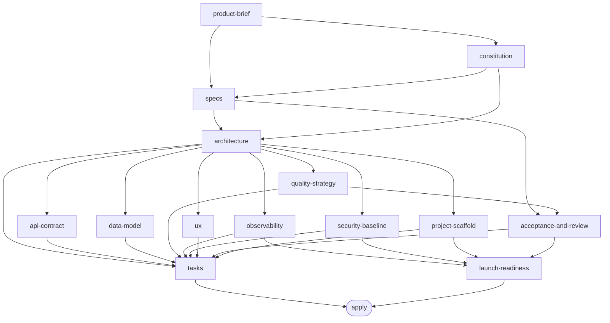
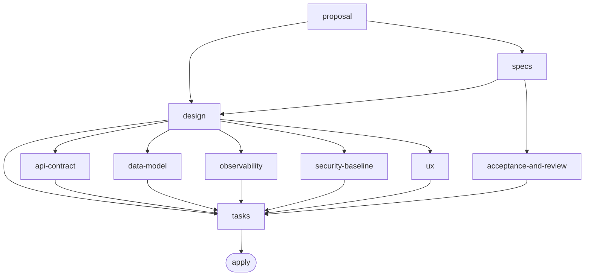
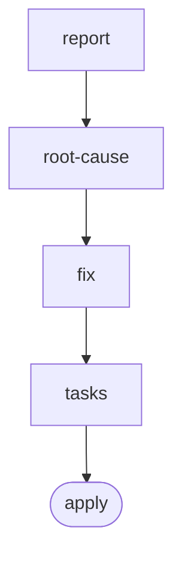
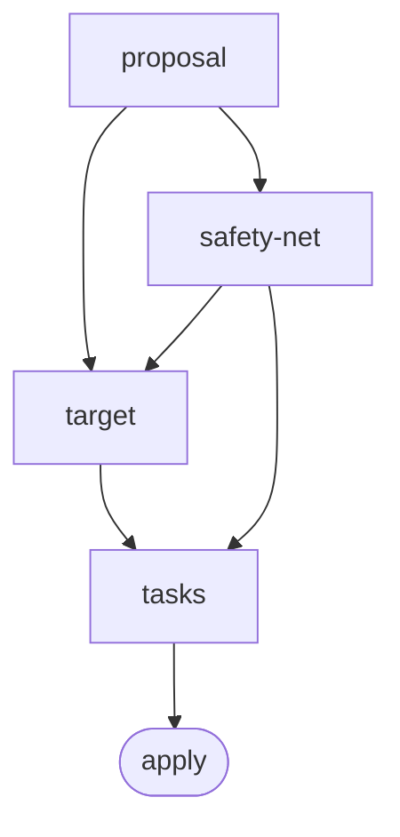
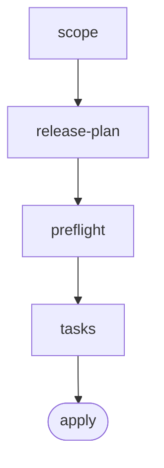

# openspec-schemas

A reusable, MIT-licensed library of custom [OpenSpec](https://github.com/Fission-AI/OpenSpec)
workflow schemas covering full-stack software development — plus auxiliary
workflows. Schemas are technology-stack agnostic.

> **Status:** the flagship schema `greenfield-bootstrap` is **available** at
> `openspec/schemas/greenfield-bootstrap/` (`openspec schema validate` passes).
> See the design doc:
> [`docs/superpowers/specs/2026-06-19-openspec-schemas-greenfield-design.md`](docs/superpowers/specs/2026-06-19-openspec-schemas-greenfield-design.md)
> and the implementation plan:
> [`docs/superpowers/plans/2026-06-19-greenfield-bootstrap-schema.md`](docs/superpowers/plans/2026-06-19-greenfield-bootstrap-schema.md).

## What is a schema?

In OpenSpec, a **schema** is a development *workflow*: an ordered chain of
artifacts (each with a template + an instruction that guides the AI) plus an
`apply` phase. A project picks one schema per change. This library provides
schemas tuned to different **change shapes**.

## Schemas

| Schema | Shape | Status |
|---|---|---|
| `greenfield-bootstrap` | New full-stack project → verified, launch-ready MVP | ✅ Available |
| `feature` | Add a capability to an existing system | ✅ Available |
| `bugfix` | Reproduce → root cause → fix → regression | ✅ Available |
| `refactor` | Change structure without changing behavior | ✅ Available |
| `release` | Ship an existing system to production, safely & repeatedly | ✅ Available |

## Artifact flows

Each schema is a dependency DAG of artifacts feeding an `apply` phase. An
artifact becomes available once its dependencies are complete. (GitHub renders
these Mermaid graphs.)

### `greenfield-bootstrap`

`DEFINE → PLAN → BUILD → VERIFY → REVIEW → SHIP` — 14 artifacts + apply.

### `feature`

Add a capability to an existing system — 10 artifacts + apply. Concerns are
deltas to the current baseline.

### `bugfix`

Debugging-first, strictly linear — 4 artifacts + apply. `fix` is blocked until
`root-cause` is confirmed (the Iron Law).

### `refactor`

Behavior-preserving — 4 artifacts + apply. `safety-net` gates `target` and
`tasks`.

### `release`

Ship to production, linear with gates — 4 artifacts + apply.

## Recommended tooling (optional)

Schemas reference capabilities tool-agnostically. For browser-based
verification, a good concrete option is gstack [`browse`](https://github.com/garrytan/gstack)
(headless Chromium CLI). Install and run only with the user's consent.

## Credits & license

MIT — see [`LICENSE`](LICENSE). This project synthesizes patterns from several
MIT-licensed projects; attribution and notices are in [`CREDITS.md`](CREDITS.md).
